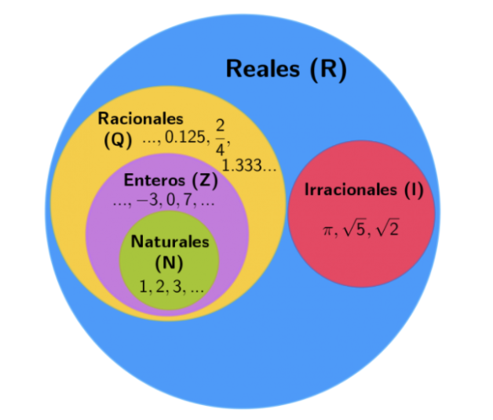
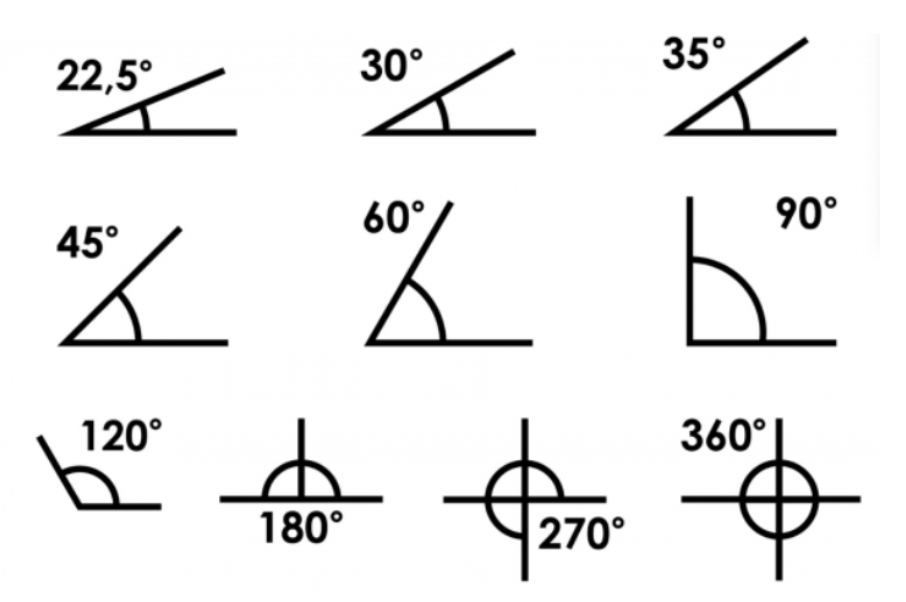
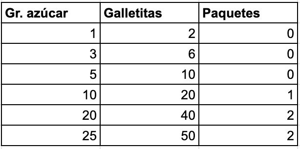
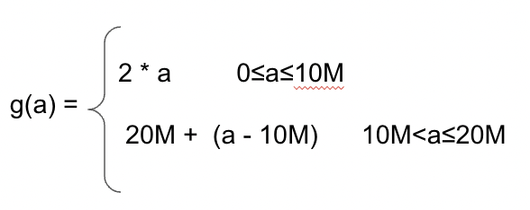
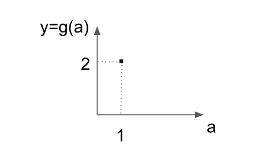
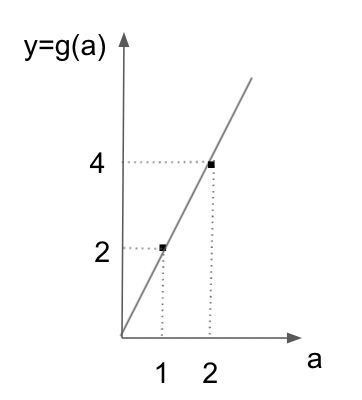
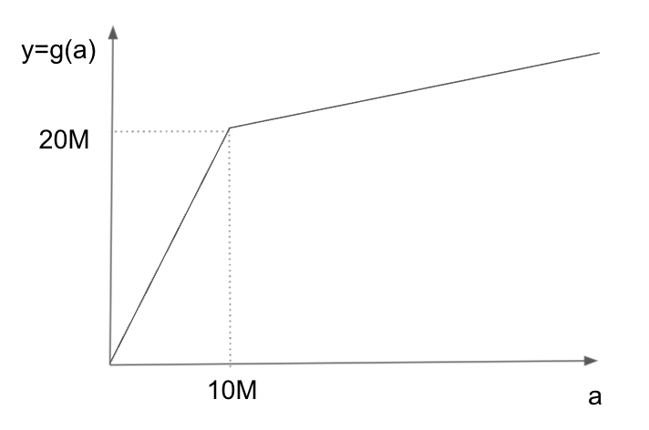
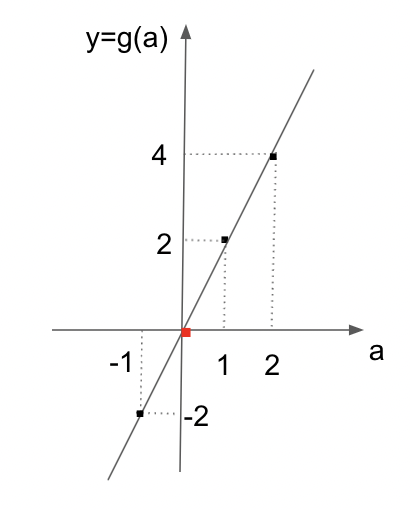

# Introducción a Cálculo I

## Temario

* Conceptos generales
* Funciones
* Gráficos
* Ecuación de la recta

## Conceptos generales

### Tipos de números

Según su naturaleza; existen los siguientes tipos de números

* **Naturales**: 0, 1, 2, … (enteros, es decir sin coma, mayores o iguales que cero)
* **Enteros**: -2, -1, 0, 1…(naturales + los enteros negativos)
* **Reales**
  * *Racionales*: números con coma que pueden representarse como una fracción
  1.223, 100002.44
  * *Irracionales*: números con coma que NO pueden representarse como una fracción y tienen infinitos dígitos tras la coma
  Los ejemplos típicos son el famoso “Pi”, “e” o el “numero de oro” (mas info http://xtec.cat/~fgonzal2/curio_irrac.html)

Cada uno de estos grupos, o conjuntos, tienen infinitos elementos. Es decir, para cualquier número elegido siempre va a haber un número mayor (o menor en el caso de un negativo). El concepto de infinito es recurrente en matemática.

Una fracción es una división entre dos números. En muchas aplicaciones se usa la nomenclatura X/Y donde X e Y son diferentes números Enteros. Por ejemplo, en vez de 0.5 se puede escribir 1/2 y se lee “un medio” o mundanamente “la mitad”. Mas en http://hnaranjo.com/blog/numeros-racionales/.

Como puedes imaginar, la ventaja de los números racionales es que por más “largos” que sean (largos=dígitos después de la coma) siempre se pueden representar en su totalidad. En cambio, un número irracional no se puede representar totalmente en una cantidad finita de dígitos.

Cada tipo tiene usos diferentes. Por ejemplo, en programación un número entero no se guarda en memoria de la misma manera que un racional. Otra diferencia existe en el uso de distintos tipos de números para representar la realidad a través de datos en algoritmos de machine learning.

Si buscas en internet vas a encontrar más categorías como los complejos, imaginarios, periódicos cuya definición es interesante pero menos relevante a este curso.

En el siguiente gráfico vas a encontrar las relaciones entre los conjuntos mencionados.

[comment]: <> (**Material adicional:**)

[comment]: <> (* Lecturas)

[comment]: <> (* Videos)

### Porcentajes

Rápidamente, revisaremos cómo calcular porcentajes (o proporciones, o fracciones).

Usamos porcentajes para relacionar cualquier número a 100. Cuando decimos “el 30% de 2000” nos referimos a la cantidad que sea a 2000 como lo es 30 a 100. Hay varias formas de calcularlo:

* regla de 3:

        100 ----- 30
        2000 ------ X

        X=30*2000 / 100 = 600

* fracciones:

        30% es lo mismo que 30/100, entonces para calcular el 30% de 2000 hacemos 30/100* 2000 (regla para recordar, “de” en matemática se traduce a “*”) que es igual a 30/100 * 200 = 600

* número decimal:

       30% es lo mismo que 30/100 que es lo mismo que 0,3.
       Entonces, podemos hacer directamente 0,3 * 2000 = 600

Naturalmente, las 3 opciones llevan al mismo cálculo y resultado. Podes elegir la que te resulte más sencilla.

Por último, un porcentaje no es necesariamente un número menor. Por ejemplo, el 230% de 2000 es:

    X=230*2000 / 100 = 4600
    230/100* 2000 = 4600
     2,3 * 2000 = 600

o también “el doble (200%) más el 30%” o sea 2000*2+600.

[comment]: <> (**Material adicional:**)

[comment]: <> (* Lectura 1)

[comment]: <> (* Video 1)

### Geometría: Ángulos y trigonometría

Un ángulo se puede definir como la medida de abertura entre dos rectas. El concepto se usa mucho en análisis matemático y álgebra ya que mide la relación entre distintos elementos en el espacio, o la inclinación de una recta respecto a la horizontal.

En grados, una abertura nula corresponde a 0°. Cuando dos rectas tienen un ángulo de 0, se dice que son paralelas. Luego podemos ir agrandando el ángulo hasta 90°, donde los dos vectores son perpendiculares (ver en la imagen). Un cuadrado tiene cuatro ángulos de 90° que se llaman también ángulos rectos. Si seguimos agrandando en un momento volvemos a crear una horizontal, que es equivalente a dos veces una abertura recta o sea 180°. Con esta lógica, el ángulo se puede seguir agrandando hasta la posición inicial habiendo recorrido 360°. 360° corresponde entonces a la misma posición que 0°, pero indicando que se ha recorrido el círculo entero una vez (lo cual tiene aplicaciones en casos donde se analizan por ejemplo movimientos en función del tiempo).

Solo porque nociones como seno y coseno son bastante usadas en cálculo y álgebra, vamos a refrescar los conceptos yendo a los puntos claves.

Tomando cualquier ángulo entre dos rectas del ejemplo anterior, podemos trazar una recta (azul) más entre ambas y formar un triángulo.

Si además la recta que trazamos forma un ángulo recto con alguna de las existentes (señalado en el ejemplo con un cuadradito), tenemos lo que se llama un triángulo recto el cual es muy utilizado entre otras cosas, por su seno y coseno.

Esquema de un ángulo recto y el nombre que se les da a sus lados:

Cada uno de los lados (X,Y,H) tienen una medida (por ejemplo, en centímetros). En matemática, cuando nos referimos a la medida de un segmento usamos || alrededor de su nombre. En este caso, |X| es la medida del lado que hemos llamado X, por ejemplo 1,5 cm. Con estos
conceptos en mente, seno, coseno y tangente del  ángulo  en cuestión son:

**coseno**=|X|/|H| (la medida del lado contiguo, aca llamado X, dividido la medida del lado H)

**seno**=|Y|/|H| (la medida del lado opuesto, aca llamado Y, dividido la medida del lado H)

**tangente**=|Y|/|X| (que es lo mismo que seno/coseno)

Yendo un poco más allá: imaginemos un triángulo como este, donde |H|=1. En este caso, tenemos directamente que
coseno=|X|, seno=|Y| y tangente=|Y|/|X|

Si H mide 1, X e Y miden imperativamente menos que 1 (tiene lógica!), por lo que el seno y el coseno pueden valer entre 0 y 1 (también valores negativos, entre 0 y -1 para ángulos entre 180° y 360°).
Si imaginamos  ángulo  tan chico como sea posible (0°), entonces el lado Y desaparece (|Y|=0) y |X|=|H|=1.
Es decir, el seno(0°)=0 y el coseno(0°)=1. Con la misma lógica, si abrimos  ángulo  hasta los 90° sucede lo contrario donde X desaparece (|X|=0) y |Y|=|H|=1.
Entonces, el seno(90°)=1 y el coseno(90°)=0. En la sección Gráficos, veremos qué forma tienen esas relaciones visualmente.

[comment]: <> (**Material adicional:**)

[comment]: <> (* Lectura 1)

[comment]: <> (* Video 1)

### Operar con logaritmos y potencias

Esta sección es meramente operatoria así que iremos directo al grano con algunas lecturas propuestas:

Para entender:
https://miprofe.com/propiedades-de-la-potenciacion-y-logaritmo/

Algunos ejercicios y su resolución:
https://www.superprof.es/apuntes/escolar/matematicas/algebra/log/ejercicios-de-logaritmos.html

[comment]: <> (**Material adicional:**)

[comment]: <> (* Lectura 1: )

[comment]: <> (* Video 1: )

## Funciones

### Definición

Uno de los conceptos más importante del análisis matemático, y sin dudas el más importante de este módulo, es el de **función**.
Una **función** es una relación entre elementos de **entrada** y elementos de **salida**.
También podemos pensar a una función como una fábrica a la cual entran elementos y salen otros.
Por ejemplo, una fábrica de galletitas utiliza 10 gr de azúcar por paquete de 20 galletitas. Por cada gramo de azúcar que entra a la fábrica, sale una galletita y cada 20 galletitas, un paquete.

Esta relación se puede escribir en forma de tabla de la siguiente forma:

Para explicar el trabajo de esta fábrica de la manera más sencilla posible,
nos conviene extraer la relación de manera numérica.
En este caso, podemos ver que independientemente de la cantidad de gramos de azúcar que entran,
el número de galletitas que salen es el doble de esa cantidad:

i- **galletitas = gramos_azúcar * 2**

En cuanto a cantidad de paquetes, la relación es de

ii- **paquetes = galletitas / 10**

Para obtener el número de paquetes en función de la cantidad de azúcar y no del número de galletitas,
podemos reemplazar [**galletitas**] por su equivalente [**gramos_azúcar * 2**] y nos queda

iii- **paquetes = [gramos_azúcar * 2] / 10 = gramos_azúcar / 5**

La operación que acabamos de realizar se llama también **composición de funciones** y tiene muchas aplicaciones en
la vida real. Pueden leer más sobre funciones compuestas empezando por https://es.wikipedia.org/wiki/Funci%C3%B3n_compuesta.

Siguiendo con la idea de simplificar las expresiones, en matemática en general usamos la manera más corta posible
de referirnos a las cosas, lo cual es en general su primera letra: **galletitas = g**, **gramos_azúcar = a**
y **paquetes = p**. Entonces

iv- **g = 2 * a** .

Para los paquetes podemos definir dos relaciones, en función de gramos de azúcar y en función de galletitas.
Para aclarar en función de qué cantidad está definida la relación, se usan paréntesis:

v- **p(g) = g / 10**

y

**p(a) = a / 5**

Pasando de fracciones a número decimal, obtenemos

vi- **p(g) = 0,1 * g**

y

**p(a) = 0,2 * a**

### Dominio e imágen

Las relaciones que definimos hasta ahora, en principio, no definen qué rango permite la entrada.
Por ejemplo, si entran 10M de gramos en un día, la fábrica satura y no puede fabricar al mismo
ritmo que antes. Para establecer en qué rango de entrada una función es válida se define su **dominio**.
En nuestro ejemplo, podemos decir que el dominio de iv es D={0,10M} (de 0 a 10M) ya que
valores negativos no tienen sentido en este caso y a partir de 10M la fábrica satura y fabrica mas
lentamente. Otro concepto importante es el de **imagen**. La imagen de una función es el rango de datos de salida
de la misma y depende del dominio. Para iv, con el dominio que hemos definido, la Im={0,20M}.

Toda función posee un dominio e imagen natural que pueden ser luego restringidos por razones prácticas.
En nuestro ejemplo, el dominio natural es Dom={-inf, inf}=R (se lee de menos infinito a infinito, que es equivalente a R, todos los números reales existentes) ya que la funcioó admite como entrada cualquier
número. Un contraejemplo sería la función **y = 1/x** ya que ESTÁ PROHIBIDO dividir por cero. Entonces, el dominio natural de esta función es Dom=R-{0} (se lee todos los reales menos el 0).

### Función partida

Como hemos visto, toda función tiene su dominio e imagen naturales sobre lo que se puede definir un dominio igual o mas restrictivo
en función del fenómeno que se desea describir. A veces, un fenomeno es más complejo y se comporta de manera diferente
para distintos rangos de entrada. Para estos casos, podemos hacer uso de **funciones partidas**.

Como dijimos, la fábrica a partir de 10M g de azúcar ya no puede fabricar al mismo ritmo.
Hasta 10M g fabrica 20M galletitas. Si recibe más azúcar, el restante (a - 10M) va a ser procesado
menos eficazmente obteniendo solo 1 galletita por gramo y desperdiciando azúcar.
Como vemos en la definición, la fábrica no acepta más de 20M g de azúcar.

Con el concepto de dominio e imagen, podemos definir:
"Una función matemática es una relación que se establece entre dos conjuntos, a través de la cual a cada
elemento del primer conjunto (dominio) se le asigna un único elemento del segundo conjunto (imagen) o ninguno. "

[comment]: <> (**video: más ejemplos! puede ser la velocidad y algo que sube y baja)

[comment]: <> (mencionar variable dependiente, independiente**)

[comment]: <> (**Material adicional:**)

[comment]: <> (* Lectura 1)

[comment]: <> (* Video 1)

## Gráficos

En teoría del cálculo, el gráfico de una función es el conjunto de puntos que resulta de asociar a cada elemento
del dominio su imagen correspondiente. Podemos imaginar esta representación en formato de tabla como vimos al principio de la sección,
donde cada línea representa un punto.

Para permitir una lectura más rápida e inteligible del comportamiento de una función, es muy usual
representar sus puntos en un **eje de coordenadas**.

La variable que se representa en el eje horizontal se llama variable independiente (y se representa muchas veces con la
letra x) mientras que la que se representa en el eje vertical se llama variable dependiente (y muchas veces la van a encontrar
con el nombre de y).

**Representación de un punto en el eje de coordenadas**

**Representación de la relación g(a) = 2 * a**

**Representación de la función compuesta que define g(a)**

Como pueden imaginar, existen muchísimas otras maneras de representar visualmente la relación entre datos además del eje de coordenadas!

[comment]: <> (**video y ejercicios: mostrar mas funciones, diferentes dibujos)

[comment]: <> (ejercicios: hacer otros dibujos**)

[comment]: <> (**Material adicional:**)

[comment]: <> (* Lectura 1)

[comment]: <> (* Video 1)

## Ecuación de la recta

La recta, su representación en el eje y su función asociada son de los elementos más usados en la para representar
distintos fenómenos (con distintos niveles de aproximación) del mundo físico.

Como vimos en nuestro ejemplo anterior, podemos modelizar la producción de galletitas de una fábrica en función
de los gramos de azúcar disponibles como **g(a) = 2 * a**. Su gráfica en ejes cartesianos tiene la forma:

Como se puede ver, geométricamente esta función determina una **recta** que pasa por el origen
de coordenadas, representado por un punto rojo cuando a=0 y g=0, o (0,0).
A diferencia de antes, donde habíamos definido un dominio mayor a cero (ya que no tiene sentido hablar de valores
negativos de gramos de azúcar para este caso), ahora extendimos la gráfica de la recta a valores negativos de **a**,
lo cual da como resultado valores negativos de **g**. Otro aspecto fundamental de la recta es su **inclinación**.
Una inclinación de 0 da como resultado una recta horizontal, paralela al eje **x** (o **a** en este ejemplo).
En este caso, la inclinación es de **2** ya que por cada incremento de una unidad de la variable independiente **a**,
la variable dependiente **g** aumenta de 2. El valor de la inclinación, también llamada pendiente, puede aumentar indefinidamente.
Cuando este valor "tiende a" o "se parece a" infinito (veremos el concepto de tendencia más adelante)
la recta resultante se parece a una vertical.

[comment]: <> (**EJERCICIOS: dibujar rectas)

[comment]: <> (es funcion o no)

[comment]: <> (por qué 'se parece a' y no 'es')

[comment]: <> (VIDEO; mas ejemplos de casos modelizados lineales**)

Con estos conceptos, definimos la función que describe una recta como

**y(x) = a * x + b**

donde **a** corresponde a la **pendiente** y **b** se llama **coordenada al orígen** (y refiere al valor de la función que corresponde a x=0).

La pendiente de una recta está también íntimamente relacionada con con ángulo que forma la recta con el eje horizontal, de la siguiente forma:

**a = tan(ang)**

## Homework

Completa la tarea descrita en el archivo [README](https://github.com/soyHenry/Math4Data/blob/main/01-Intro-Calculo-I/Ejercicios.md)

<table class="hide" width="100%" style='table-layout:fixed;'>
  <tr>
    <td>
      <a href="https://airtable.com/shrSzEYT4idEFGB8d?prefill_clase=00-PrimerosPasos">
        
         
        Hacé click acá para dejar tu feedback sobre esta clase.
      </a>
    </td>
  </tr>
</table>
